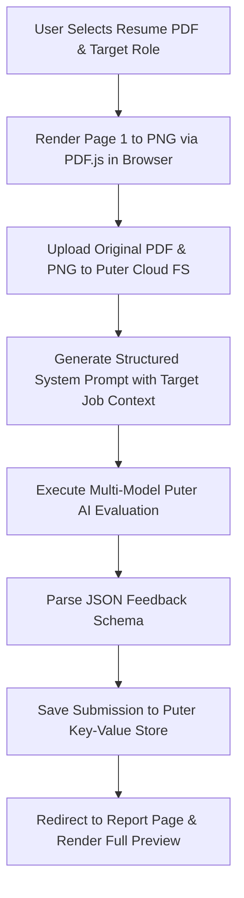

# 📄 Resumind — AI-Powered Resume & ATS Analyzer

<div align="center">

  
  
  
  
  
  
  

  <p align="center">
    <strong>Smart AI resume evaluation, Applicant Tracking System (ATS) compliance scoring, analytics dashboard, search/filtering, and actionable feedback tailored for your target job position.</strong>
  </p>

</div>

---

## 🌟 Overview

**Resumind** is a modern, high-performance web application designed to help job seekers optimize their resumes for Applicant Tracking Systems (ATS) and hiring managers. Powered by **React Router v7**, **React 19**, and **Puter.js AI**, Resumind parses uploaded PDF resumes, renders in-browser preview thumbnails, evaluates content against target job descriptions, and provides structured feedback across key dimensions:

- 🎯 **ATS Suitability Score & Checklist**
- ✍️ **Tone & Style Assessment**
- 📝 **Content Quality Evaluation**
- 📐 **Structural & Formatting Analysis**
- 💡 **Skill Gap & Alignment Recommendations**

---

## ✨ Key Features & Capabilities

- **🌗 Dark & Light Theme System**: Sliding glass segmented toggle switch with smooth 700ms page-wide transition animations and `localStorage` persistence.
- **📊 Analytics Metrics Hero**: Dashboard metrics tracking *Total Submissions*, *Average ATS Score*, *Top Rating*, and *80+ Match Tier Count*.
- **🔍 Real-Time Search & Category Filters**: Search submissions by company name or target job role; filter by score tiers (*All, 80+ Excellent, 60-79 Good, <60 Needs Work*).
- **🖼️ Smart PDF Thumbnail Preview with Fallbacks**: Client-side rendering via PDF.js worker, featuring multi-retry Puter FS loading and stylized document card fallbacks.
- **🤖 Multi-Model AI Analysis**: Fallback strategy attempting `claude-3-5-sonnet` -> `gpt-4o` -> `gpt-4o-mini` -> default Puter AI model.
- **🗑️ Resume Review Deletion**: Inline delete triggers on dashboard cards and review pages with interactive confirmation modals.
- **🖨️ PDF Report Exporting**: One-click print/export formatted report for offline reading or sharing.
- **🔐 Cloud Authentication**: Integrated passwordless Puter SSO to protect and sync submission history.

---

## 🛠️ Tech Stack & Ecosystem

| Layer | Technology | Description |
| :--- | :--- | :--- |
| **Framework** | [React Router v7](https://reactrouter.com/) | Full-stack SPA/SSR framework |
| **UI Engine** | [React 19](https://react.dev/) | Component rendering engine |
| **Language** | [TypeScript 5.8](https://www.typescriptlang.org/) | End-to-end type safety |
| **Styling** | [Tailwind CSS v4](https://tailwindcss.com/) | Utility-first CSS engine with `@variant dark` & glassmorphism |
| **State Management** | [Zustand 5](https://zustand-demo.pmnd.rs/) | Global state store for Puter SDK & Theme context |
| **AI & Storage SDK** | [Puter.js v2](https://puter.com/) | Cloud AI execution, File System (`fs`), and Key-Value DB (`kv`) |
| **PDF Rendering** | [pdfjs-dist](https://mozilla.github.io/pdf.js/) | Mozilla PDF.js library for client-side canvas image extraction |
| **Bundler** | [Vite 6](https://vitejs.dev/) | Fast HMR and production bundle optimization |

---

## 📁 Project Directory & File Structure

```
resume_analyzer/
├── 📂 app/                           # Core application source code
│   ├── 📂 components/                # Modular React UI components
│   │   ├── 📄 Accordion.tsx          # Collapsible sections for category-wise feedback
│   │   ├── 📄 ATS.tsx                # ATS score badge, checklist, and tip copy triggers
│   │   ├── 📄 Details.tsx            # Comprehensive breakdown (Tone, Content, Structure, Skills)
│   │   ├── 📄 FileUploader.tsx       # Drag-and-drop dropzone component with state highlights
│   │   ├── 📄 Navbar.tsx             # Floating glass navigation bar with branding & theme toggle
│   │   ├── 📄 ResumeCard.tsx         # Dashboard card item with fallback preview & delete modal
│   │   ├── 📄 ScoreBadge.tsx         # Color-coded score pill badge
│   │   ├── 📄 ScoreCircle.tsx        # Dynamic gradient circular progress gauge
│   │   ├── 📄 ScoreGauge.tsx         # Speedometer-style dynamic overall rating meter
│   │   ├── 📄 Summary.tsx            # High-level category score overview card
│   │   └── 📄 ThemeToggle.tsx        # Segmented sliding glass switch for Light/Dark mode
│   ├── 📂 lib/                       # Utilities & context providers
│   │   ├── 📄 pdf2img-cdn.ts         # In-browser PDF renderer via PDF.js worker CDN
│   │   ├── 📄 puter.ts               # Zustand store wrapper for Puter.js (Auth, FS, AI, KV)
│   │   ├── 📄 theme.tsx              # Theme Provider Context with transition triggers
│   │   └── 📄 utils.ts               # Helper utilities (UUID, class merge, size format)
│   ├── 📂 routes/                    # React Router page routes
│   │   ├── 📄 auth.tsx               # User authentication gateway page
│   │   ├── 📄 home.tsx               # Analytics dashboard, search, filters & card grid
│   │   ├── 📄 resume.tsx             # Detailed evaluation report page & export PDF toolbar
│   │   ├── 📄 upload.tsx             # 3-step upload form & AI evaluation pipeline
│   │   └── 📄 wipe.tsx               # Storage cleanup utility route
│   ├── 📄 app.css                    # Multi-stop background gradients & theme transition CSS
│   ├── 📄 root.tsx                   # Main HTML layout, Puter SDK injection & ThemeProvider
│   └── 📄 routes.ts                  # Route registry definitions for React Router v7
├── 📂 constants/                     # Static constants & AI system prompts
├── 📂 public/                        # Static assets (icons, background graphics)
├── 📂 types/                         # TypeScript interfaces (Resume, Feedback, Puter SDK)
├── 📄 package.json                   # Dependencies and scripts
├── 📄 react-router.config.ts         # React Router configuration
├── 📄 tsconfig.json                  # TypeScript compiler settings
└── 📄 vite.config.ts                 # Vite build settings
```

---

## 🔄 Application Architecture Flow



---

## 🚀 Getting Started

### Prerequisites

- **Node.js**: `v20.x` or higher
- **npm**: `v10.x` or higher

### Development Workflow

1. **Clone & Install**
   ```bash
   git clone https://github.com/arpon-dutta07/ai_resume_analyzer.git
   cd resume_analyzer
   npm install
   ```

2. **Run Local Dev Server**
   ```bash
   npm run dev
   ```
   Open `http://localhost:5173`.

3. **Verify Type Safety**
   ```bash
   npm run typecheck
   ```

4. **Production Build**
   ```bash
   npm run build
   npm run start
   ```

---

## 📄 License

This project is licensed under the **MIT License**.

---

<div align="center">
  Crafted with ❤️ using <strong>React Router v7</strong>, <strong>Tailwind CSS v4</strong> & <strong>Puter AI</strong>.
</div>
