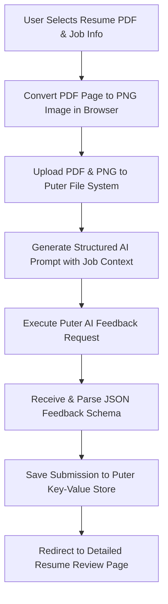

# 📄 Resumind — AI-Powered Resume & ATS Analyzer

<div align="center">

  
  
  
  
  
  

  <p align="center">
    <strong>Smart resume evaluation, ATS compliance scoring, and actionable feedback tailored for your target job position.</strong>
  </p>

</div>

---

## 🌟 Overview

**Resumind** is a modern full-stack web application designed to help job seekers optimize their resumes for Applicant Tracking Systems (ATS) and hiring managers. Built with **React Router v7**, **React 19**, and powered by **Puter.js AI**, Resumind converts uploaded PDF resumes into high-resolution canvas preview images, analyzes content against target job descriptions, and returns structured feedback across key dimensions:

- 🎯 **ATS Suitability Score & Tips**
- ✍️ **Tone & Style Assessment**
- 📝 **Content Quality Evaluation**
- 📐 **Structural & Formatting Analysis**
- 💡 **Skill Gap & Alignment Recommendations**

---

## ✨ Key Features

- **📄 Drag-and-Drop Resume Upload**: Upload PDF resumes effortlessly with real-time file validation using `react-dropzone`.
- **🖼️ Client-Side PDF-to-Image Rendering**: In-browser conversion of PDF files to PNG images using `pdfjs-dist` for instant visual previewing.
- **🤖 AI-Powered Resume Feedback**: Deep analysis powered by Puter.js AI with custom prompt instructions aligned to job titles and descriptions.
- **📊 Comprehensive Score Visualizations**: Interactive SVG score gauges, circular progress indicators, and overall rating badges.
- **📂 Cloud Storage & KV Database**: Automatic serverless file storage (`puter.fs`) and structured JSON persistence (`puter.kv`) for all analyzed submissions.
- **🔐 Cloud Authentication**: Integrated passwordless Puter authentication to protect and sync resume review history.
- **📱 Responsive & Animated UI**: Glassmorphic styling, smooth CSS transitions, and dynamic step-by-step processing loaders.

---

## 🛠️ Tech Stack & Ecosystem

| Layer | Technology | Description |
| :--- | :--- | :--- |
| **Framework** | [React Router v7](https://reactrouter.com/) | Full-stack SSR & client routing framework |
| **UI Library** | [React 19](https://react.dev/) | Core UI rendering engine |
| **Language** | [TypeScript 5.8](https://www.typescriptlang.org/) | Type safety across application code and SDK interfaces |
| **Styling** | [Tailwind CSS v4](https://tailwindcss.com/) | Modern utility-first CSS framework with `@tailwindcss/vite` |
| **State Management** | [Zustand 5](https://zustand-demo.pmnd.rs/) | Global state store for Puter SDK integration |
| **AI & Storage SDK** | [Puter.js v2](https://puter.com/) | Serverless AI execution, File System (`fs`), and Key-Value DB (`kv`) |
| **PDF Processing** | [pdfjs-dist](https://mozilla.github.io/pdf.js/) | Mozilla PDF.js library for rendering PDF pages to Canvas/Image |
| **Bundler & Tooling** | [Vite 6](https://vitejs.dev/) | Lightning-fast HMR and bundle compilation |

---

## 📁 Project Directory & File Structure

```
resume_analyzer/
├── 📂 app/                           # Core application source code
│   ├── 📂 components/                # Modular React UI components
│   │   ├── 📄 Accordion.tsx          # Collapsible sections for category-wise feedback
│   │   ├── 📄 ATS.tsx                # ATS score badge and tailored improvement tips
│   │   ├── 📄 Details.tsx            # Comprehensive breakdown (Tone, Content, Structure, Skills)
│   │   ├── 📄 FileUploader.tsx       # Drag-and-drop dropzone component for PDF files
│   │   ├── 📄 Navbar.tsx             # Header navigation bar with branding & user status
│   │   ├── 📄 ResumeCard.tsx         # Dashboard card item for past uploaded resumes
│   │   ├── 📄 ScoreBadge.tsx         # Color-coded numeric score badge
│   │   ├── 📄 ScoreCircle.tsx        # Circular SVG progress indicator
│   │   ├── 📄 ScoreGauge.tsx         # Speedometer-style dynamic score meter
│   │   └── 📄 Summary.tsx            # High-level score summary overview card
│   ├── 📂 lib/                       # Utility libraries & SDK integrations
│   │   ├── 📄 pdf2img-cdn.ts         # In-browser PDF renderer via PDF.js worker CDN
│   │   ├── 📄 pdf2img.ts             # Alternate local PDF page conversion handler
│   │   ├── 📄 puter.ts               # Zustand store wrapper for Puter.js (Auth, FS, AI, KV)
│   │   └── 📄 utils.ts               # Helper functions (UUID generation, class merge)
│   ├── 📂 routes/                    # React Router route pages
│   │   ├── 📄 auth.tsx               # User sign-in & cloud authentication gateway
│   │   ├── 📄 home.tsx               # Main dashboard listing user's analyzed resumes
│   │   ├── 📄 resume.tsx             # Detailed feedback view for a single resume ID
│   │   ├── 📄 upload.tsx             # Resume upload form & step-by-step scanning pipeline
│   │   └── 📄 wipe.tsx               # Maintenance route to clear stored resume data
│   ├── 📄 app.css                    # Custom CSS variables, background styling & tokens
│   ├── 📄 root.tsx                   # Main HTML shell, Puter SDK injection & Error Boundary
│   └── 📄 routes.ts                  # Route registry definitions for React Router v7
├── 📂 constants/                     # Application static constants
│   └── 📄 index.ts                   # Structured AI prompt template & fallback data
├── 📂 public/                        # Static assets (images, icons, scanning GIFs)
├── 📂 types/                         # TypeScript interfaces and global type declarations
│   ├── 📄 index.d.ts                 # Data models for Resume, Feedback & Categories
│   └── 📄 puter.d.ts                 # Type definitions for Puter.js SDK APIs
├── 📄 .dockerignore                  # Docker build exclusion rules
├── 📄 Dockerfile                     # Multi-stage production container build config
├── 📄 package.json                   # Project dependencies and script definitions
├── 📄 react-router.config.ts         # React Router SSR configuration
├── 📄 tsconfig.json                  # TypeScript compiler settings & alias mappings
└── 📄 vite.config.ts                 # Vite build & plugin settings
```

---

## 🔄 How It Works (Application Flow)



1. **Upload & Render**: The user uploads a resume PDF and enters target company/job details. `pdfjs-dist` converts page 1 into a high-resolution PNG image on the client side.
2. **Cloud Storage**: Both original PDF and generated PNG image are stored in serverless Puter storage (`puter.fs.upload`).
3. **AI Evaluation**: Puter AI evaluates the text and job context using custom system prompts, outputting strict JSON matching the `Feedback` schema.
4. **Persistence & Presentation**: Results are saved to Puter KV store (`resume:{uuid}`), enabling users to review overall scores, ATS compatibility, and specific actionable suggestions anytime.

---

## 🚀 Getting Started

### Prerequisites

Ensure you have the following installed locally:
- **Node.js**: `v20.x` or higher
- **npm**: `v10.x` or higher

### Installation

1. **Clone the Repository**
   ```bash
   git clone https://github.com/arpon-dutta07/ai_resume_analyzer.git
   cd resume_analyzer
   ```

2. **Install Dependencies**
   ```bash
   npm install
   ```

3. **Start Development Server**
   ```bash
   npm run dev
   ```
   Open your browser at `http://localhost:5173`.

4. **Type Check**
   ```bash
   npm run typecheck
   ```

5. **Production Build**
   ```bash
   npm run build
   npm run start
   ```

---

## 🐳 Docker Deployment

The repository includes a multi-stage `Dockerfile` optimized for minimal production image footprint using standard Node 20 Alpine base layers.

### Build Image
```bash
docker build -t resumind-app .
```

### Run Container
```bash
docker run -d -p 3000:3000 --name resumind resumind-app
```
Access the containerized application at `http://localhost:3000`.

---

## 📄 License

This project is licensed under the **MIT License**.

---

<div align="center">
  Crafted with ❤️ using <strong>React Router v7</strong> & <strong>Puter AI</strong>.
</div>
